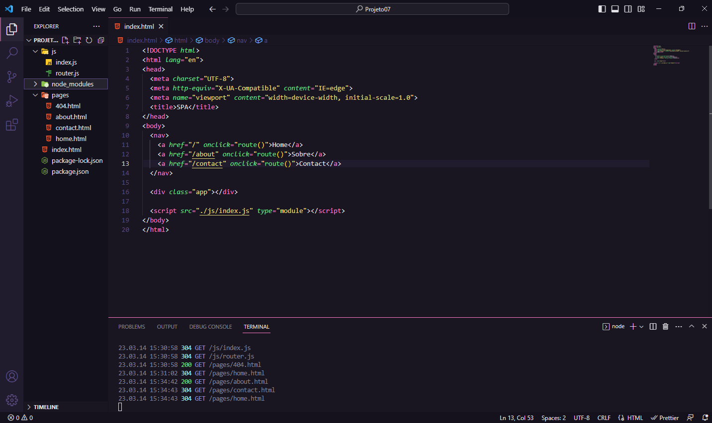

<h1 align="center"> study-spa</h1>

 

## 🖥️ Tecnologias

Esse estudo foi desenvolvido com as seguintes tecnologias:

- HTML
- javaScript
- NodeJS
- Git e Github

## 📂 Projeto

  Esse estudo foi para fortalecer alguns conceitos aprendidos entre eles:

      <li>Conceitos de SPA</li>
      <li>Mapeamento de rotas</li>
      <li>Assíncrono e promises</li>
      <li>Orientação a objetos</li>
      <li>Classes e muito mais</li>
     
  </ul>

 

## 📧 Contato

E-mail: victorvbprogramador@gmail.com

Linkedin: https://www.linkedin.com/in/victor-vinicius-9b0765263/

